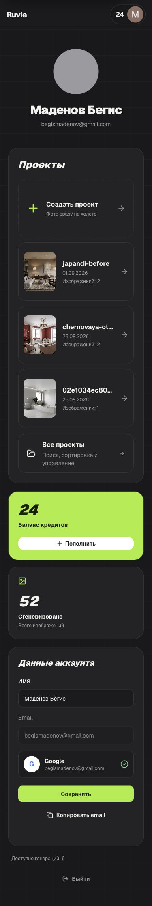
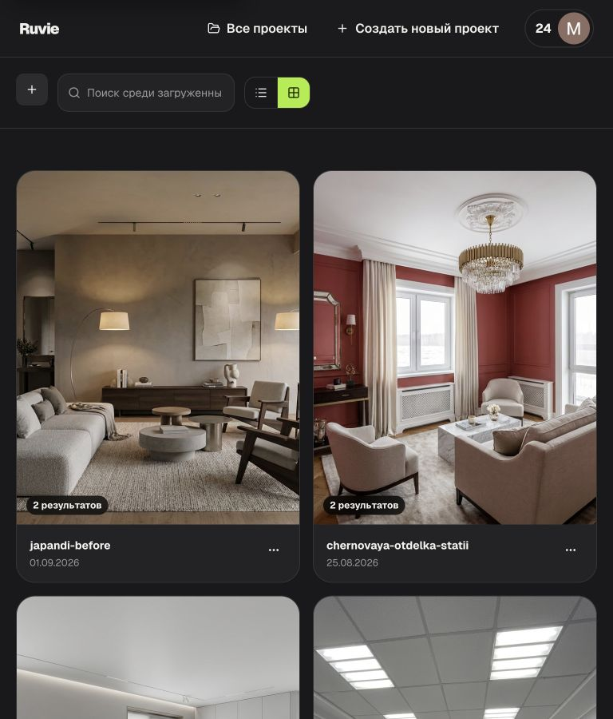
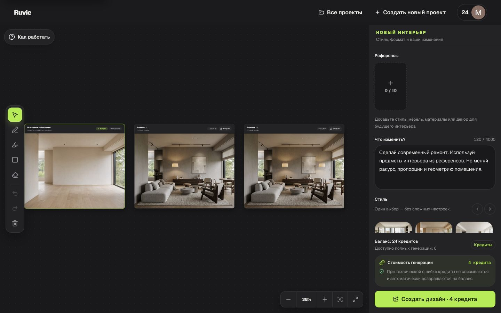
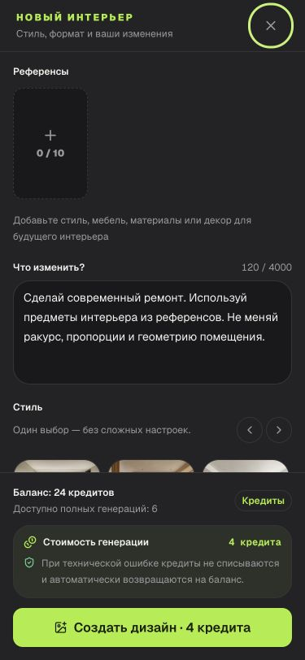
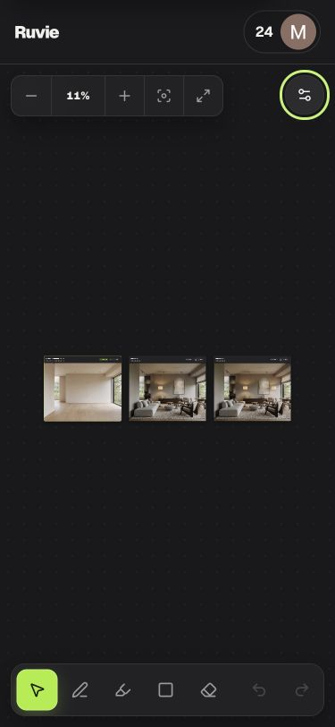
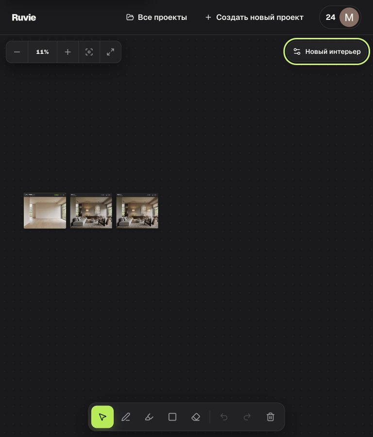

# Design QA — production

- Дата: 2 сентября 2026 года
- Среда: `https://ruvie.cc`
- Production commits с исправлениями: `8ccc39e`, `7233ad6`
- Production deployment: `dpl_CX2dAa3MCj8MAAxYP3ap8UZQiy1Q` (`READY`)
- Контрольные viewport: 375 × 812, 768 × 900 и 1440 × 900 px
- Итог: `PASSED`

## Scope и цель

Проверены профиль, каталог проектов, рабочее пространство, desktop/mobile
inspector, карточки исходника и результатов, touch targets, focus, закрытие
диалога с клавиатуры, возврат фокуса, async/error semantics, изображения и
горизонтальное переполнение. Цель — подтвердить, что основной production-flow
остается понятным и управляемым на телефоне, планшете и desktop.

## Сценарий и состояние шагов

1. Профиль при 375 px — `passed`.
   - После исправления `clientWidth = scrollWidth = 375`; offscreen-элементов нет.
   - Карточки имеют ширину 335 px и остаются внутри viewport.
   - Кнопки сохранения и копирования складываются вертикально.
2. Каталог проектов при 375 и 768 px — `passed`.
   - При обеих ширинах документ не имеет горизонтального overflow.
   - Поиск, переключатель вида, карточки и действия сохраняют понятную иерархию.
3. Workspace при 375 px — `passed`.
   - Холст, zoom controls, inspector trigger и нижняя панель доступны без
     горизонтального overflow страницы.
   - Все восемь кнопок панели разметки имеют фактический размер 44 × 44 px;
     длинная панель прокручивается внутри собственного rail.
4. Mobile inspector при 375 px — `passed`.
   - Открывается как именованный modal dialog, начальный focus видим на кнопке
     закрытия.
   - `Escape` закрывает inspector; focus возвращается на кнопку
     «Открыть настройки интерьера» и `aria-expanded` становится `false`.
5. Workspace при 768 px — `passed`.
   - `clientWidth = scrollWidth = 768`, touch controls и inspector trigger
     доступны; панель разметки помещается полностью.
6. Workspace при 1440 px — `passed`.
   - Inspector постоянно видим справа: 380 × 828 px.
   - Исходник, `Вариант 1` и `Вариант 1.1` имеют одинаковые внешние frame
     dimensions 288 × 243 px после чистой загрузки.

## Скриншоты

### 1. Полный профиль, 375 px

### 2. Каталог проектов, 768 px

### 3. Workspace с desktop inspector, 1440 px

### 4. Mobile inspector, 375 px

### 5. Mobile workspace, 375 px

### 6. Tablet workspace, 768 px

## Сильные стороны

- Одна визуальная система сохраняется во всех проверенных разделах.
- Лаймовый primary action и focus ring хорошо различимы на темном фоне.
- Canvas media использует `object-contain`; изображения не растягиваются и не
  обрезаются. Preview-карточки используют ожидаемый image-first `object-cover`.
- Loading и mutation states имеют `role="status"`/`aria-live`; ошибки имеют
  `role="alert"`.
- Основные действия представлены нативными `button`, `a`, `input`, `textarea`
  и `radio`, а inspector имеет имя через `aria-labelledby`.

## Найденные и исправленные дефекты

- [Resolved P1] Профиль при 375 px расширял документ до 536 px.
  - Причина: CSS Grid сохранял intrinsic min-content width карточек.
  - Исправление: явные `minmax(0,1fr)`, `min-w-0` для вложенных grid items и
    вертикальная компоновка form actions на узком экране.
- [Resolved P1] Кнопки mobile toolbar сжимались до 37 × 44 px.
  - Исправление: `flex: 0 0 2.75rem`; production-замер подтверждает 44 × 44 px.
- [Resolved P1] Browser-emulated `Escape` не закрывал native mobile inspector.
  - Исправление: явный keyboard fallback на dialog; production-проверка
    подтверждает закрытие и возврат focus.
- [Previously resolved] Карточки исходника и результатов имели разную высоту.
  - Production-замер 1440 px подтверждает одинаковые 288 × 243 px frames.

## Остаточные риски и пределы проверки

- Это не сертификат полного соответствия WCAG: отдельный screen reader и
  физические iOS/Android-устройства не использовались.
- На 375 px последняя кнопка длинного toolbar доступна горизонтальной прокруткой,
  поэтому ее визуальная обнаруживаемость немного ниже, чем у первых действий.
- Старый source screenshot находился во временной macOS-папке и к моменту
  прогона был удален. Текущий результат опирается на production screenshots,
  design system и измеримые acceptance criteria; ранее найденное расхождение
  карточек повторно проверено напрямую.

## Автоматизированная регрессия

`pnpm release:check` прошел после каждого набора исправлений:

- 211 тестов основного приложения;
- 21 UI/unit-тест админки;
- 7 server-тестов админки;
- TypeScript, ESLint, Next.js build, Vite build;
- Prisma schema и статус 17 migrations.

final result: passed
